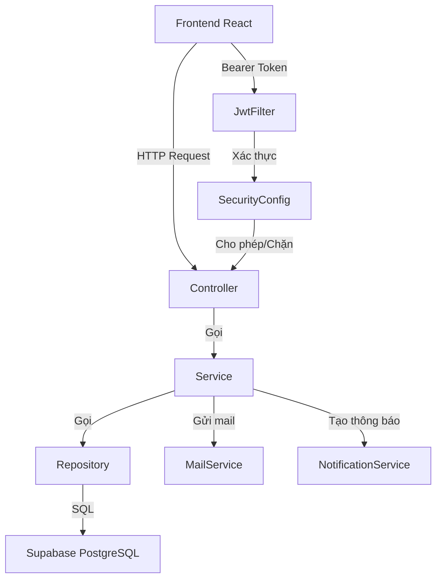
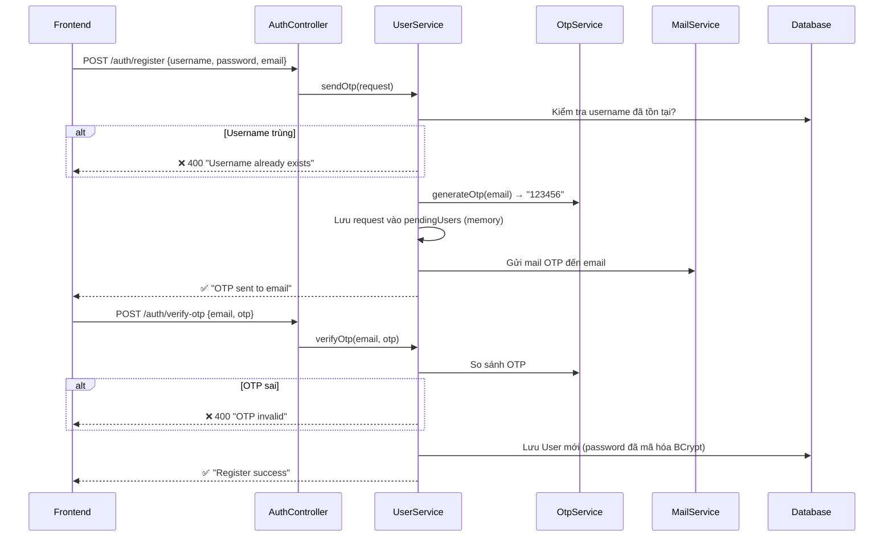
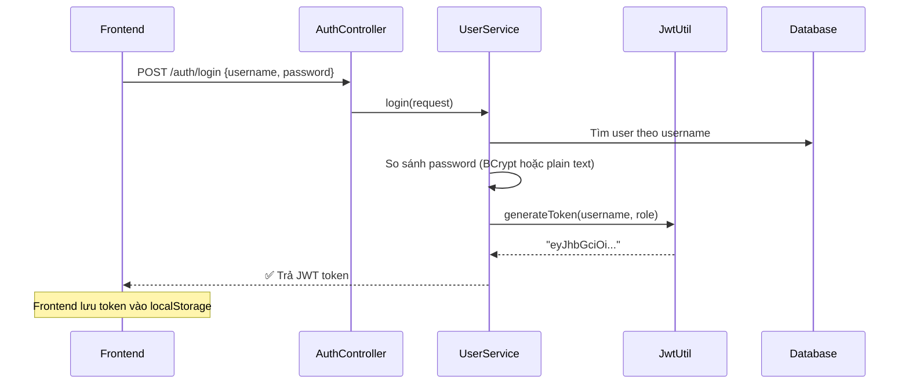
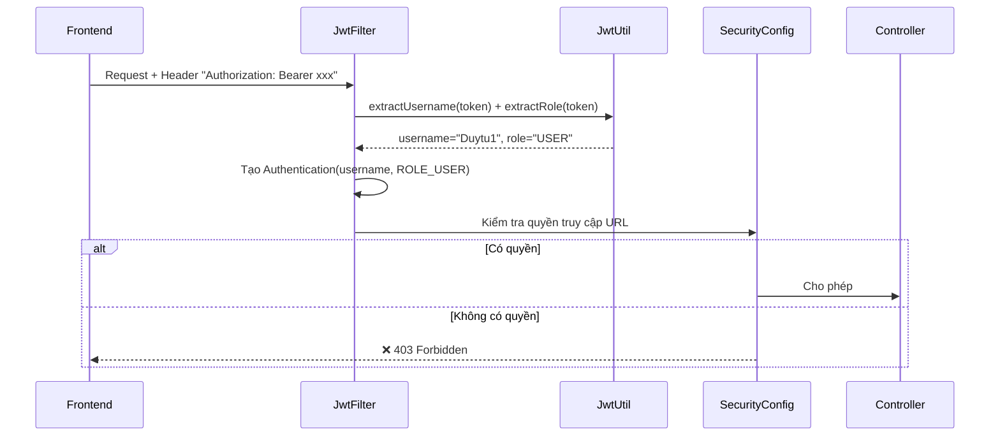
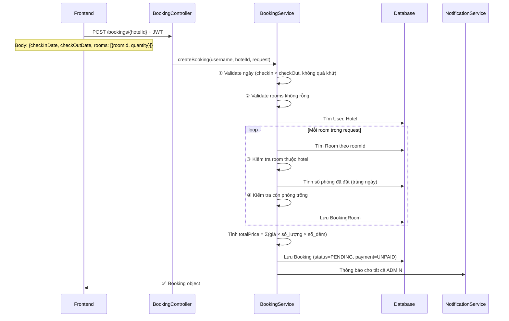
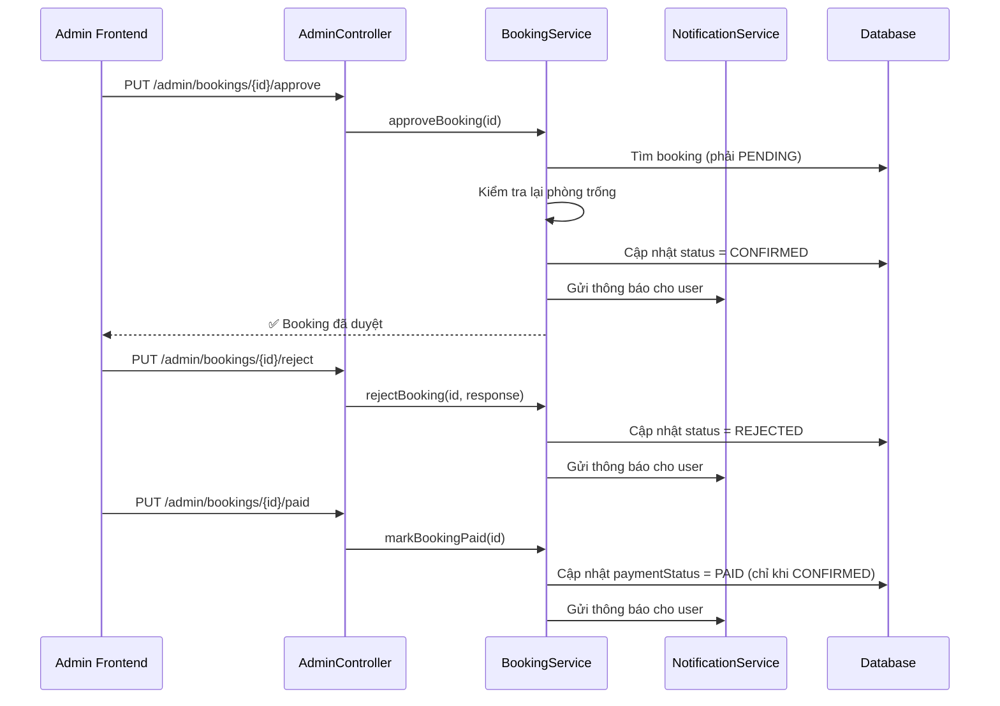
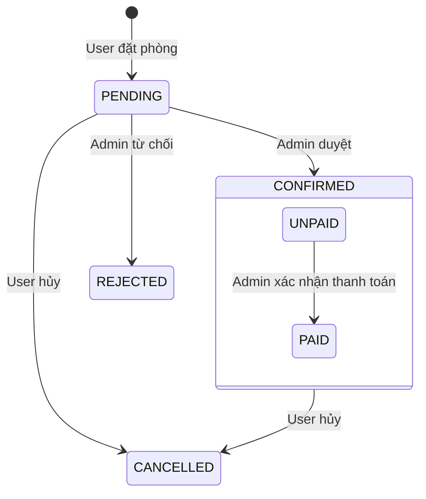
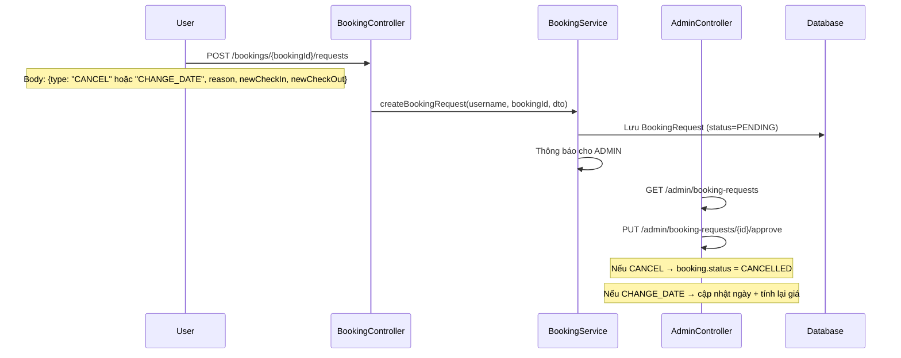
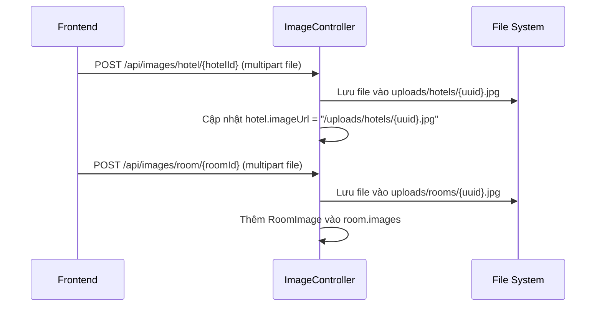

# Giải thích Backend - WebBookingCuoiKy

## 1. Kiến trúc tổng quan



### Phân lớp (Layer)

| Lớp | Thư mục | Vai trò |
|-----|---------|---------|
| **Controller** | `controller/` | Nhận request từ frontend, trả response |
| **Service** | `service/` | Xử lý logic nghiệp vụ |
| **Repository** | `repository/` | Truy vấn database (JPA) |
| **Entity** | `entity/` | Ánh xạ bảng trong database |
| **DTO** | `dto/` | Dữ liệu frontend gửi lên (request body) |
| **Security** | `security/` | JWT token, xác thực, phân quyền |
| **Config** | `config/` | Cấu hình Security, CORS, Swagger |

---

## 2. Luồng đăng ký (Register + OTP)



> [!IMPORTANT]
> **`pendingUsers`** và **`otpStorage`** đều lưu trong **bộ nhớ RAM** (HashMap). Nếu server restart giữa chừng → mất hết OTP và thông tin đăng ký đang chờ.

---

## 3. Luồng đăng nhập (Login + JWT)



**Sau khi login**, mọi request tiếp theo frontend gửi kèm header:
```
Authorization: Bearer eyJhbGciOi...
```

---

## 4. Luồng xác thực JWT (mọi request)



### Bảng phân quyền URL

| URL Pattern | Quyền |
|-------------|-------|
| `/auth/**` | ✅ Ai cũng truy cập được (không cần token) |
| `/swagger-ui/**`, `/v3/api-docs/**` | ✅ Public |
| `/uploads/**` | ✅ Public (ảnh tĩnh) |
| `GET /hotels/**`, `GET /rooms/**` | ✅ Public |
| `POST/PUT/DELETE /hotels/**` | 🔒 Cần đăng nhập (bất kỳ user) |
| `/admin/**` | 🔴 Chỉ ADMIN |
| `/users/**` | 🔴 Chỉ ADMIN |
| `/bookings/**` | 🔒 Cần đăng nhập |
| `/notifications/**` | 🔒 Cần đăng nhập |
| `/api/images/**` | 🔒 Cần đăng nhập |
| `/api/reviews/**` | 🔒 Cần đăng nhập |

> [!WARNING]
> `POST/PUT/DELETE /hotels/**` hiện tại **bất kỳ user đăng nhập** đều gọi được (không chỉ ADMIN). Nếu muốn chỉ ADMIN mới CRUD hotel, cần thêm rule trong SecurityConfig.

---

## 5. Luồng đặt phòng (Booking)



### Công thức tính giá
```
totalPrice = Σ (pricePerNight × quantity × số_đêm)
số_đêm = checkOutDate - checkInDate (tính theo ngày)
```

### Kiểm tra phòng trống
```
available = room.quantity - SUM(đã đặt trong khoảng ngày trùng)
```
Chỉ tính các booking có status **PENDING** hoặc **CONFIRMED** (bỏ qua CANCELLED, REJECTED).

---

## 6. Luồng Admin duyệt/từ chối booking



### Vòng đời Booking



---

## 7. Luồng yêu cầu hủy/đổi ngày (BookingRequest)



### 2 loại request

| Type | Khi approve |
|------|------------|
| `CANCEL` | Booking chuyển sang `CANCELLED` |
| `CHANGE_DATE` | Cập nhật checkIn/checkOut mới + tính lại totalPrice |

---

## 8. Luồng upload ảnh



Ảnh được serve qua [WebConfig.java](file:///d:/WebBookingCuoiKy/src/main/java/com/Nhom2/booking/config/WebConfig.java): URL `/uploads/**` → thư mục `./uploads/` trên server.

---

## 9. Thông báo (Notification)

- Mỗi hành động quan trọng tạo **Notification** lưu vào DB
- User xem: `GET /notifications/my`
- Đánh dấu đã đọc: `PUT /notifications/{id}/read`

| Sự kiện | Ai nhận thông báo |
|---------|-------------------|
| User đặt phòng | Tất cả ADMIN |
| User hủy booking | Tất cả ADMIN |
| User gửi request (hủy/đổi ngày) | Tất cả ADMIN |
| Admin duyệt/từ chối booking | User sở hữu booking |
| Admin xác nhận thanh toán | User sở hữu booking |
| Admin duyệt/từ chối request | User sở hữu booking |

---

## 10. Admin Dashboard & Báo cáo

### Thống kê (`GET /admin/statistics/overview`)
Trả về JSON chứa:
- Tổng users, admins, hotels, rooms
- Số booking theo từng status (pending, confirmed, rejected, cancelled)
- Số request đang chờ
- Tổng doanh thu (booking đã PAID)

### Xuất Excel (`GET /admin/reports/bookings.xlsx`)
Xuất file Excel chứa tất cả booking, dùng thư viện **Apache POI**.

---

## ⚠️ Các lưu ý quan trọng

### 1. OTP & pendingUsers lưu trong RAM
```java
private final Map<String, String> otpStorage = new HashMap<>();       // OtpService
private final Map<String, RegisterRequest> pendingUsers = new HashMap<>();  // UserService
```
- **Restart server = mất hết** OTP và request đăng ký đang chờ
- OTP **không hết hạn** — ai biết OTP thì dùng bất kỳ lúc nào
- Dự án cuối kỳ thì OK, production cần lưu vào Redis/DB + thêm TTL

### 2. Gửi mail mỗi lần login
```java
// UserService.login() - line 126-130
mailService.sendMail(user.getEmail(), "Đăng nhập thành công", ...);
```
User login nhiều lần sẽ bị **spam mail**. Cân nhắc bỏ nếu không cần.

### 3. POST/PUT/DELETE Hotel không chỉ ADMIN
Hiện tại bất kỳ user đăng nhập đều có thể tạo/sửa/xóa hotel. Nếu muốn chỉ ADMIN:
```java
// SecurityConfig.java - thêm dòng này trước .anyRequest()
.requestMatchers(HttpMethod.POST, "/hotels/**").hasRole("ADMIN")
.requestMatchers(HttpMethod.PUT, "/hotels/**").hasRole("ADMIN")
.requestMatchers(HttpMethod.DELETE, "/hotels/**").hasRole("ADMIN")
```

### 4. Credentials hard-coded
Database password, JWT secret, Gmail password đều nằm trực tiếp trong source code. Dự án cuối kỳ thì chấp nhận được, nhưng **đừng push lên GitHub public**.

### 5. Entity `BookingRequest` trùng tên DTO
Cả `entity/BookingRequest.java` và `dto/BookingRequest.java` đều tên `BookingRequest` → trong code phải dùng full path `com.Nhom2.booking.entity.BookingRequest` để phân biệt. Không gây lỗi nhưng hơi rối.
