# 📋 WebBookingCuoiKy — Phân Tích Dự Án Toàn Diện

---

## 1. Tổng Quan Kiến Trúc

**Tech Stack**: Spring Boot (Java 17) + React (TypeScript/Vite) + PostgreSQL (Supabase)

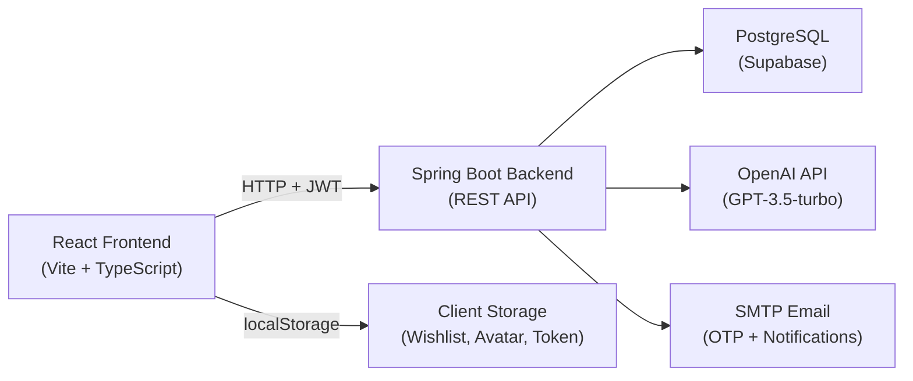

**Luồng chính**: Frontend React → HTTP Request + JWT Bearer Token → JwtFilter xác thực → SecurityConfig phân quyền → Controller → Service → Repository → PostgreSQL

---

## 2. Cấu Trúc Dự Án (Directory Tree)

```
WebBookingCuoiKy/
├── pom.xml                          # Maven dependencies
├── SQL.sql                          # Database schema
│
├── src/main/java/com/Nhom2/booking/
│   ├── BackendcuoikyApplication.java   # Spring Boot entry point
│   │
│   ├── config/
│   │   ├── SecurityConfig.java         # JWT + Role-based security
│   │   ├── SwaggerConfig.java          # Swagger/OpenAPI docs
│   │   └── WebConfig.java              # Static resource + CORS
│   │
│   ├── security/
│   │   ├── JwtUtil.java                # JWT token generation/validation
│   │   └── JwtFilter.java             # Request filter for JWT auth
│   │
│   ├── entity/                        # JPA Entities (DB tables)
│   │   ├── User.java                  # Users (USER/ADMIN roles)
│   │   ├── Hotel.java                 # Hotels
│   │   ├── Room.java                  # Rooms (belongs to Hotel)
│   │   ├── RoomImage.java             # Room photos
│   │   ├── Booking.java               # Bookings
│   │   ├── BookingRoom.java           # Booking ↔ Room (junction)
│   │   ├── BookingRequest.java        # Cancel/Change requests
│   │   ├── Review.java                # Hotel reviews
│   │   ├── Notification.java          # In-app notifications
│   │   └── AppConfig.java             # Key-value config (API keys)
│   │
│   ├── enums/
│   │   ├── BookingStatus.java         # PENDING/CONFIRMED/REJECTED/CANCELLED
│   │   ├── PaymentStatus.java         # UNPAID/PAID
│   │   ├── RequestStatus.java         # PENDING/APPROVED/REJECTED
│   │   ├── RequestType.java           # CANCEL/CHANGE_DATE
│   │   └── UserRole.java              # USER/ADMIN
│   │
│   ├── repository/                    # Spring Data JPA repositories
│   │   ├── UserRepository.java
│   │   ├── HotelRepository.java
│   │   ├── RoomRepository.java
│   │   ├── BookingRepository.java
│   │   ├── BookingRoomRepository.java
│   │   ├── BookingRequestRepository.java
│   │   ├── ReviewRepository.java
│   │   ├── NotificationRepository.java
│   │   └── AppConfigRepository.java
│   │
│   ├── dto/                           # Data Transfer Objects
│   │
│   ├── service/
│   │   ├── UserService.java           # User CRUD + auth logic
│   │   ├── HotelService.java          # Hotel search/filter
│   │   ├── RoomService.java           # Room management
│   │   ├── BookingService.java        # Booking lifecycle (18KB!)
│   │   ├── PaymentService.java        # VietQR generation
│   │   ├── ReviewService.java         # Review CRUD
│   │   ├── NotificationService.java   # In-app notifications
│   │   ├── MailService.java           # Email sending
│   │   ├── OtpService.java            # OTP generation
│   │   ├── ReportService.java         # Excel export
│   │   └── StatisticsService.java     # Dashboard metrics
│   │
│   └── controller/
│       ├── AuthController.java        # Login/Register/OTP
│       ├── HotelController.java       # Hotel CRUD
│       ├── RoomController.java        # Room CRUD
│       ├── BookingController.java     # Booking operations
│       ├── PaymentController.java     # QR payment
│       ├── AdminController.java       # Admin dashboard
│       ├── UserController.java        # User management
│       ├── ReviewController.java      # Reviews
│       ├── ImageController.java       # Image upload
│       ├── NotificationController.java# Notifications
│       ├── ChatController.java        # AI Chatbot (OpenAI proxy)
│       └── GlobalExceptionHandler.java# Error handling
│
├── frontend/
│   ├── package.json
│   ├── vite.config.ts
│   ├── index.html
│   │
│   └── src/
│       ├── App.tsx                    # Routing (React Router)
│       ├── App.css
│       ├── api.ts                     # API client (Swagger + fetch)
│       ├── index.css                  # Global styles (40KB!)
│       │
│       ├── components/
│       │   ├── Header.tsx             # Navigation bar
│       │   └── AIAssistantWidget.tsx   # Floating AI chatbot
│       │
│       ├── context/
│       │   └── WishlistContext.tsx     # Wishlist state (localStorage)
│       │
│       └── pages/
│           ├── HomePage.tsx           # Landing page + search
│           ├── LoginPage.tsx          # Login form
│           ├── SearchResults.tsx      # Search + filters + map
│           ├── HotelDetailPage.tsx    # Hotel detail (30KB!)
│           ├── HotelReviewAndChatPage.tsx # Reviews + chat (17KB)
│           └── Wishlist.tsx           # Saved hotels
```

---

## 3. Entity Relationships (ERD)

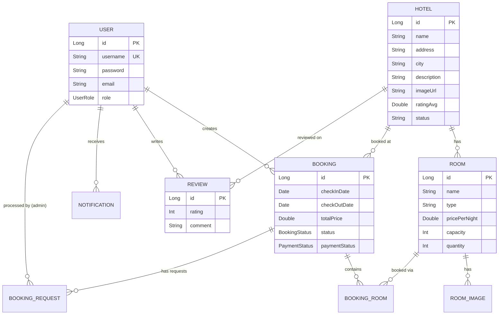

---

## 4. Tất Cả API Endpoints

### 🔓 Public (Không cần đăng nhập)

| Method | Endpoint | Mô tả |
|--------|----------|--------|
| POST | `/auth/register` | Đăng ký → gửi OTP email |
| POST | `/auth/verify-otp` | Xác thực OTP → tạo tài khoản |
| POST | `/auth/login` | Đăng nhập → trả JWT token |
| GET | `/hotels` | Danh sách khách sạn |
| GET | `/hotels/{id}` | Chi tiết khách sạn |
| POST | `/api/chat` | AI Chatbot (OpenAI proxy) |

### 🔐 Authenticated (Cần đăng nhập)

| Method | Endpoint | Mô tả |
|--------|----------|--------|
| POST | `/bookings/{hotelId}` | Đặt phòng |
| GET | `/bookings/my` | Lịch sử đặt phòng |
| PUT | `/bookings/cancel/{id}` | Hủy đặt phòng |
| POST | `/bookings/{id}/requests` | Gửi yêu cầu thay đổi/hủy |
| GET | `/bookings/{id}/payment-qr` | Tạo QR thanh toán VietQR |
| POST | `/bookings/{id}/confirm-payment` | Xác nhận đã chuyển khoản |
| GET | `/api/reviews` | Danh sách đánh giá |
| POST | `/api/reviews` | Viết đánh giá |
| POST | `/api/images/hotel/{id}` | Upload ảnh khách sạn |
| POST | `/api/images/room/{id}` | Upload ảnh phòng |
| GET | `/notifications/my` | Thông báo của tôi |
| PUT | `/notifications/{id}/read` | Đánh dấu đã đọc |

### 🛡️ Admin Only

| Method | Endpoint | Mô tả |
|--------|----------|--------|
| GET | `/admin/bookings` | Tất cả booking (filter status) |
| PUT | `/admin/bookings/{id}/approve` | Duyệt booking |
| PUT | `/admin/bookings/{id}/reject` | Từ chối booking |
| PUT | `/admin/bookings/{id}/paid` | Xác nhận đã thanh toán |
| GET | `/admin/booking-requests` | Danh sách yêu cầu |
| PUT | `/admin/booking-requests/{id}/approve` | Duyệt yêu cầu |
| PUT | `/admin/booking-requests/{id}/reject` | Từ chối yêu cầu |
| GET | `/admin/statistics/overview` | Thống kê dashboard |
| GET | `/admin/reports/bookings.xlsx` | Xuất báo cáo Excel |
| GET/POST/PUT/DELETE | `/users/**` | Quản lý users |

---

## 5. Luồng Hoạt Động Các Chức Năng (Use Cases)

### 🔑 UC1: Đăng Ký & Đăng Nhập

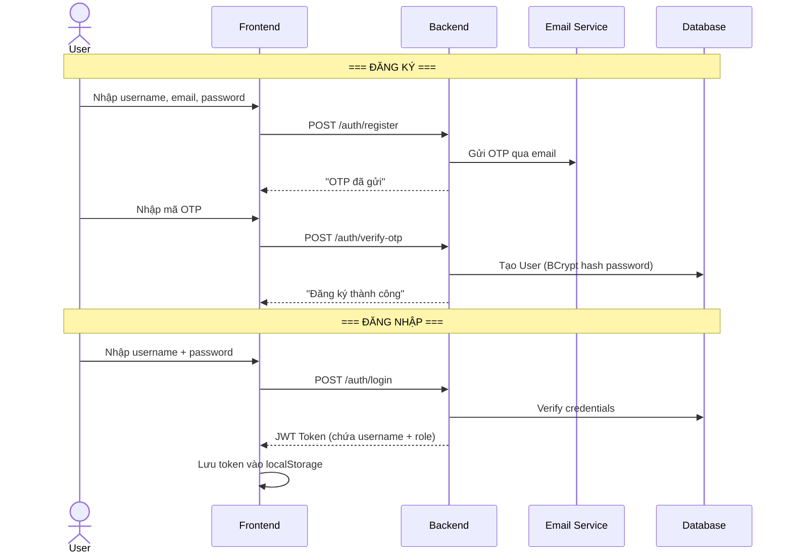

### 🔍 UC2: Tìm Kiếm & Xem Khách Sạn

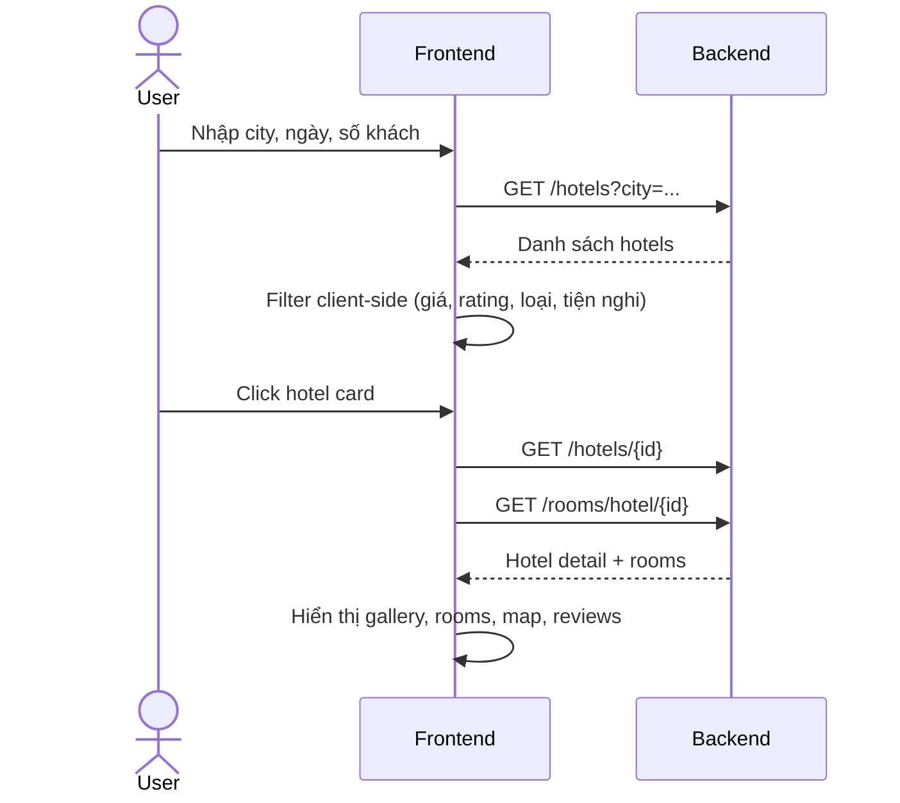

### 📅 UC3: Đặt Phòng (Booking Lifecycle)

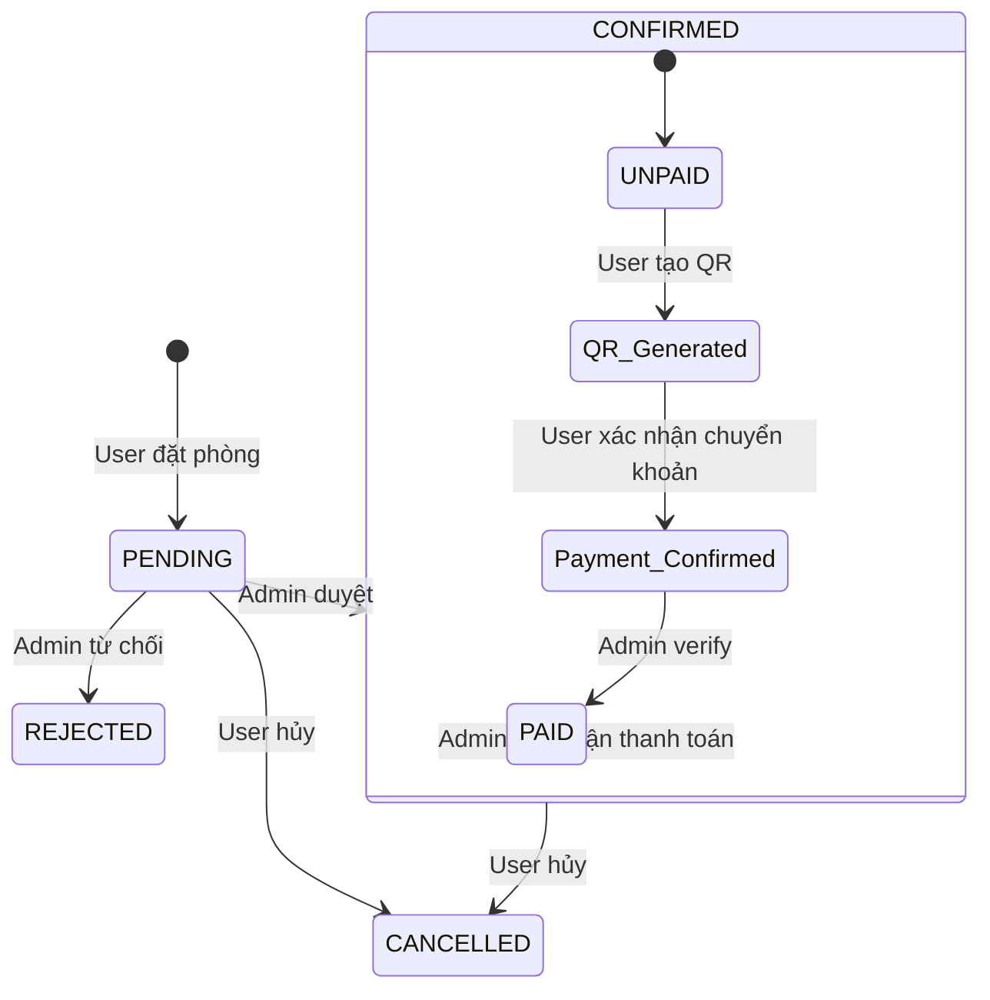

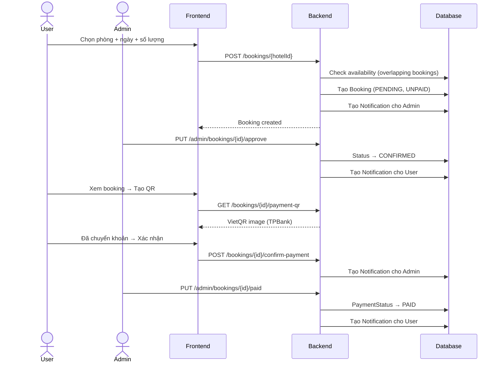

### ⭐ UC4: Đánh Giá Khách Sạn

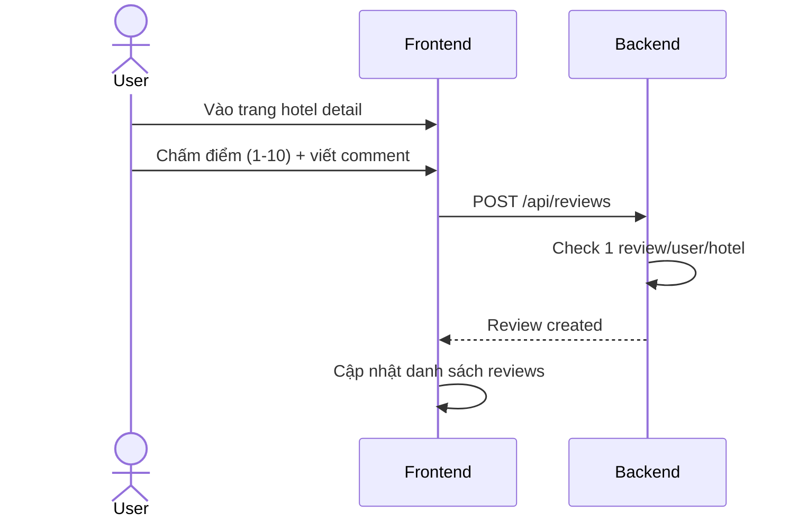

### 💬 UC5: AI Chatbot (Hiện tại)

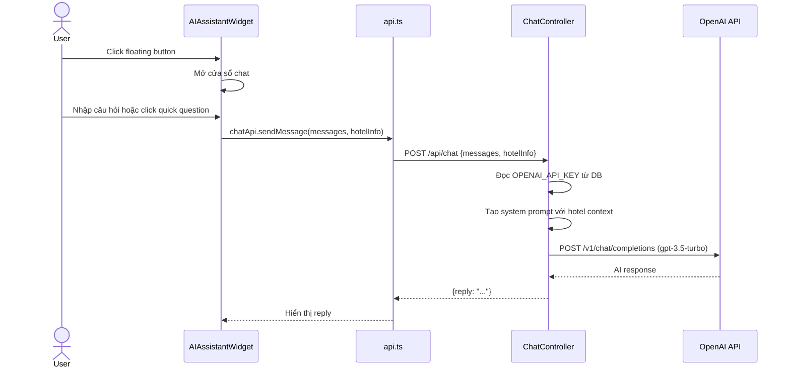

---

## 6. 🤖 Đánh Giá Chatbot Hiện Tại vs. Tiêu Chuẩn Cao Cấp

### Hiện tại có gì?

Dự án có **2 chatbot AI riêng biệt** (cùng dùng 1 backend):

| Tiêu chí | AIAssistantWidget (HomePage) | Chat trong ReviewPage |
|----------|------|------|
| Vị trí | Floating widget, chỉ ở HomePage | Embedded panel, trang review |
| Hotel context | ❌ Hardcoded thông tin chung | ✅ Dùng data hotel thật |
| Quick questions | 8 nút, tự động gửi | 5 nút, chỉ fill input |
| Typing indicator | ✅ Có animation | ⚠️ Animation có thể lỗi |
| Auto-scroll | ✅ Có | ❌ Không |
| Timestamps | ❌ Không | ✅ Có |
| Reset chat | ✅ Có | ❌ Không |
| Markdown render | ❌ Không | ❌ Không |
| Lưu lịch sử | ❌ Mất khi refresh | ❌ Mất khi refresh |

### So sánh với chatbot cao cấp (Booking.com, Agoda, Traveloka...)

| Tính năng | Cao cấp | Dự án hiện tại | Trạng thái |
|-----------|---------|----------------|------------|
| AI trả lời thông minh | ✅ | ✅ GPT-3.5 | ✅ OK |
| Floating widget toàn trang | ✅ | ⚠️ Chỉ HomePage | ❌ Thiếu |
| Context-aware (biết hotel đang xem) | ✅ | ⚠️ Chỉ 1/2 chat | ⚠️ Partial |
| Lưu lịch sử chat | ✅ | ❌ | ❌ Thiếu |
| Markdown / Rich text | ✅ | ❌ Plain text | ❌ Thiếu |
| **Chat real-time User ↔ Admin** | ✅ | ❌ Không có | ❌ **Thiếu** |
| Typing indicator | ✅ | ✅ | ✅ OK |
| Notification khi có tin nhắn | ✅ | ❌ | ❌ Thiếu |
| Avatar + tên người gửi | ✅ | ❌ | ❌ Thiếu |
| Gửi hình ảnh trong chat | ✅ | ❌ | ❌ Thiếu |
| Trạng thái online/offline | ✅ | ❌ | ❌ Thiếu |
| Rate limiting / chống spam | ✅ | ❌ | ❌ Thiếu |

> [!WARNING]
> **Kết luận**: Chatbot hiện tại chỉ là **AI proxy đơn giản** (gọi OpenAI rồi trả kết quả). Chưa có chức năng **chat real-time giữa User và Admin** — đây là tính năng quan trọng nhất còn thiếu.

---

## 7. 🔴 Chat Real-time User ↔ Admin — Giải Thích Luồng

### Công nghệ cần dùng: WebSocket + STOMP + SockJS

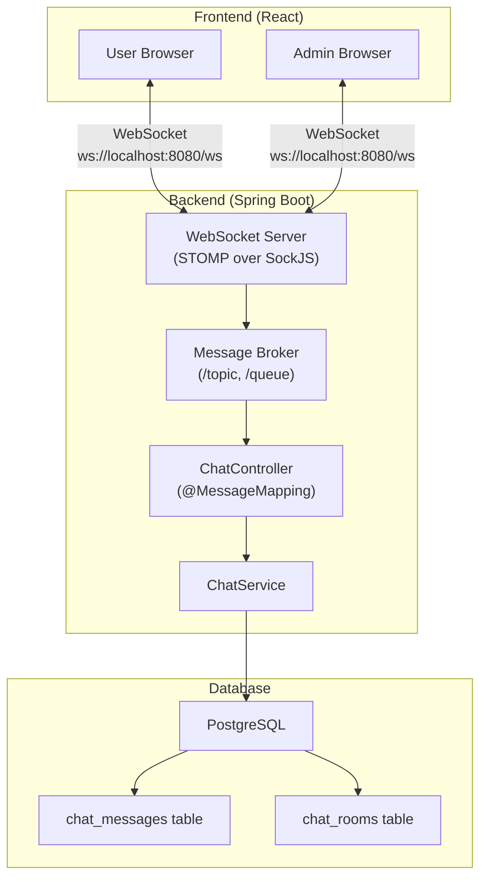

### Luồng chi tiết — User gửi tin nhắn cho Admin

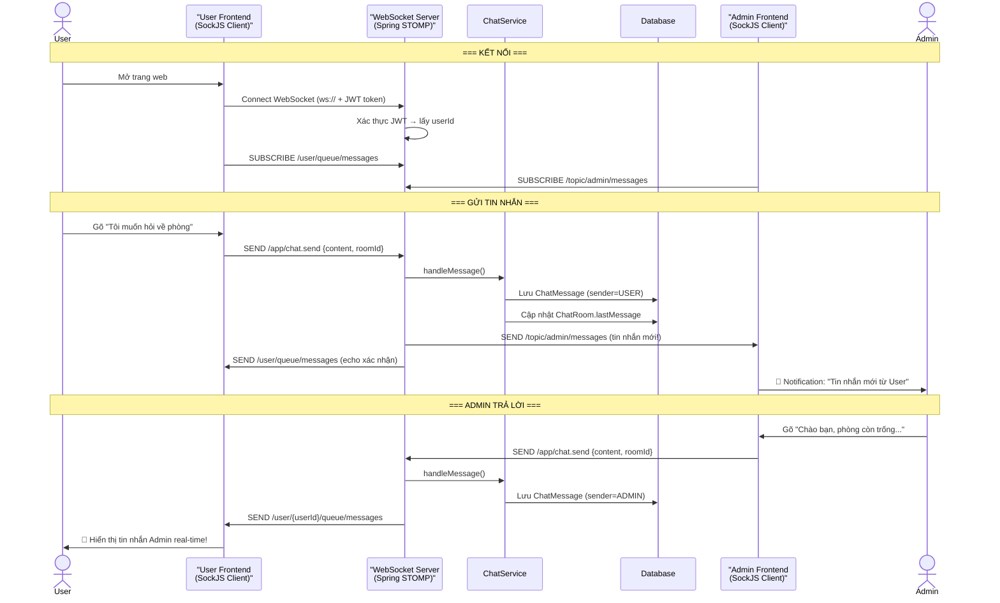

### Giải thích từng bước:

#### Bước 1 — Kết nối WebSocket
- Khi user/admin mở trang web, frontend tạo kết nối WebSocket qua **SockJS** (fallback nếu browser không hỗ trợ WebSocket).
- JWT token được gửi kèm để xác thực danh tính.
- **STOMP** (Simple Text Oriented Messaging Protocol) là protocol chạy trên WebSocket, giúp quản lý subscribe/publish dễ dàng.

#### Bước 2 — Subscribe (Đăng ký nhận tin)
- **User** subscribe vào `/user/queue/messages` — chỉ nhận tin nhắn gửi cho mình.
- **Admin** subscribe vào `/topic/admin/messages` — nhận TẤT CẢ tin nhắn từ mọi user.

#### Bước 3 — Gửi tin nhắn
- User gõ tin nhắn → Frontend gửi qua WebSocket đến `/app/chat.send`.
- Backend nhận, lưu vào DB, rồi **push ngay lập tức** cho Admin qua channel đã subscribe.
- **Không cần polling** — tin nhắn đến ngay tức thì (< 100ms).

#### Bước 4 — Admin trả lời
- Admin gõ reply → gửi qua WebSocket.
- Backend lưu DB + push cho đúng User qua `/user/{userId}/queue/messages`.

### Các Entity mới cần tạo:

```
ChatRoom (phòng chat)
├── id (Long)
├── user (User) — user tạo phòng chat
├── status (OPEN/CLOSED)
├── createdAt, lastMessageAt
│
ChatMessage (tin nhắn)
├── id (Long)
├── chatRoom (ChatRoom)
├── sender (User) — người gửi
├── content (String)
├── messageType (TEXT/IMAGE/SYSTEM)
├── readAt (LocalDateTime) — null = chưa đọc
├── createdAt
```

### Tại sao dùng WebSocket mà không dùng REST polling?

| | REST Polling | WebSocket |
|---|---|---|
| Độ trễ | 3-10 giây (tùy interval) | < 100ms (real-time) |
| Tải server | Cao (gọi liên tục dù không có tin mới) | Thấp (chỉ gửi khi có tin) |
| UX | Không mượt | Mượt như Messenger/Zalo |
| Trạng thái online | Khó implement | Dễ (biết ai đang connect) |
| Typing indicator | Rất khó | Dễ (gửi event "đang gõ...") |

---

## 8. Tổng Hợp Tất Cả Use Cases

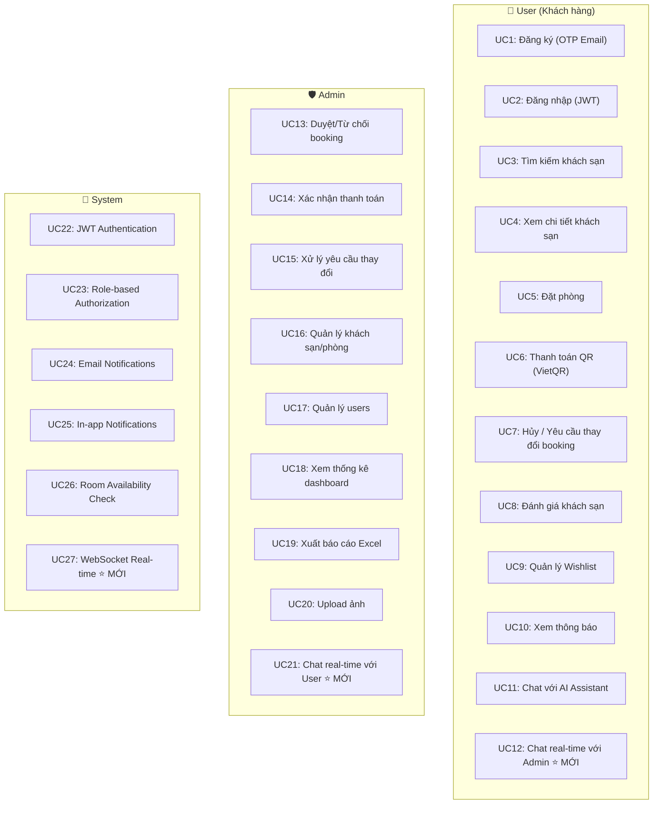

---

## 9. Danh Sách Thay Đổi Cần Làm Cho Chat Real-time

> [!IMPORTANT]
> Dưới đây là checklist các file cần tạo/sửa để thêm tính năng chat real-time User ↔ Admin.

### Backend (Spring Boot)

| Loại | File | Mô tả |
|------|------|--------|
| 📦 DEP | `pom.xml` | Thêm `spring-boot-starter-websocket` |
| 🆕 Entity | `ChatRoom.java` | Phòng chat (1 user → 1 room) |
| 🆕 Entity | `ChatMessage.java` | Tin nhắn chat |
| 🆕 Enum | `MessageType.java` | TEXT / IMAGE / SYSTEM |
| 🆕 Repository | `ChatRoomRepository.java` | Query chat rooms |
| 🆕 Repository | `ChatMessageRepository.java` | Query messages |
| 🆕 Config | `WebSocketConfig.java` | STOMP + SockJS config |
| 🆕 Security | `WebSocketAuthInterceptor.java` | JWT auth cho WebSocket |
| 🆕 Controller | `ChatWebSocketController.java` | `@MessageMapping` handlers |
| 🆕 Controller | `ChatRestController.java` | REST API load history |
| 🆕 Service | `ChatService.java` | Business logic chat |
| ✏️ Sửa | `SecurityConfig.java` | Cho phép `/ws/**` endpoint |

### Frontend (React)

| Loại | File | Mô tả |
|------|------|--------|
| 📦 DEP | `package.json` | Thêm `@stomp/stompjs`, `sockjs-client` |
| 🆕 Hook | `useWebSocket.ts` | Custom hook quản lý kết nối |
| 🆕 Context | `ChatContext.tsx` | Global chat state |
| 🆕 Component | `ChatWidget.tsx` | Widget chat User ↔ Admin (thay thế AIAssistantWidget) |
| 🆕 Page | `AdminChatPage.tsx` | Trang chat cho Admin (danh sách rooms + chat) |
| ✏️ Sửa | `App.tsx` | Thêm route + render ChatWidget globally |
| ✏️ Sửa | `Header.tsx` | Badge tin nhắn chưa đọc |

---

> [!NOTE]
> File này tổng hợp toàn bộ cấu trúc, chức năng, và luồng hoạt động của dự án WebBookingCuoiKy. Phần chat real-time (mục 7-9) mô tả kiến trúc cần xây dựng mới.
